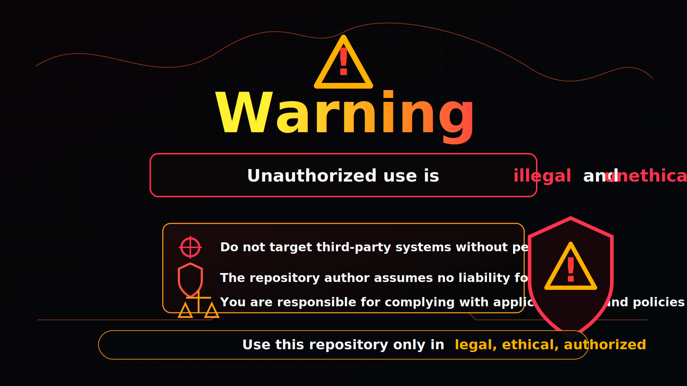

# Dork Ripper (12,000+ Dorks)

<p align="center">
  
</p>

<p align="center">
  
  
  
</p>

A comprehensive, modular, and massive repository of over **12,000 unique Google Dorks**, specifically designed to aid in security assessments, ethical hacking, bug bounty hunting, and threat intelligence. This repository consolidates highly targeted search parameters to discover exposed panels, credentials, sensitive documents, vulnerable servers, IoT devices, and much more. It includes the complete Exploit-DB Google Hacking Database (GHDB) and specialized categories.

---

## ✨ Visual Preview

<p align="center">
  
</p>

---

## ️ Search Operators

| Operator | Description | Syntax | Example |
| :--- | :--- | :--- | :--- |
| `()` | Group multiple terms or operators. Allows advanced expressions | `(<term> or <operator>)` | `inurl:(html \| php)` |
| `*` | Wildcard. Matches any word | `<text> * <text>` | `How to * a computer` |
| `""` | The given keyword has to match exactly. *case-insensitive* | `"<keywords>"` | `"google"` |
| `m..n` / `m...n` | Search for a range of numbers. $n$ should be greater than $m$ | `<number>..<number>` | `1..100` |
| `-` | Documents that match the operator are excluded. *NOT-Operator* | `-<operator>` | `-site:youtube.com` |
| `+` | Include documents that match the operator | `+<operator>` | `+site:youtube.com` |
| `\|` | Logical *OR-Operator*. Only one operator needs to match in order for the overall expression to match | `<operator> \| <operator>` | `"google" \| "yahoo"` |
| `~` | Search for synonyms of the given word. *Not supported by Google* | `~<word>` | `~book` |
| `@` | Perform a search only on the given social media platform. *Rather use `site`* | `@<socialmedia>` | `@instagram` |
| `after` | Search for documents published / indexed after the given date | `after:<yy(-mm-dd)>` | `after:2020-06-03` |
| `allintitle` | Same as **intitle** but allows multiple keywords separated by a space | `allintitle:<keywords>` | `allintitle:dog cat` |
| `allinurl` | Same as **inurl** but allows multiple keywords separated by a space | `allinurl:<keywords>` | `allinurl:search com` |
| `allintext` | Same as **intext** but allows multiple keywords separated by a space | `allintext:<keywords>` | `allintext:math science university` |
| `AROUND` | Search for documents in which the first word is up to $n$ words away from the second word and vice versa | `<word1> AROUND(<n>) <word2>` | `google AROUND(10) good` |
| `author` | Search for articles written by the given author if applicable | `author:<name>` | `author:Max` |
| `before` | Search for documents published / indexed before the given date | `before:<yy(-mm-dd)>` | `before:2020-06-03` |
| `cache` | Search on the cached version of the given website. Uses Google's cache to do so | `cache:<domain>` | `cache:google.com` |
| `contains` | Search for documents that link to the given filetype. *Not supported by Google* | `contains:<filetype>` | `contains:pdf` |
| `date` | Search for documents published within the past $n$ months. *Not supported by Google* | `date:<number>` | `date:3` |
| `define` | Search for the definition of the given word | `define:<word>` | `define:funny` |
| `ext` | Search for a specific filetype | `ext:<documenttype>` | `ext:pdf` |
| `filetype` | Refer to **ext** | `filetype:<documenttype>` | `filetype:pdf` |
| `inanchor` | Search for the given keyword in a website's anchors | `inanchor:<keyword>` | `inanchor:security` |
| `index of` | Search for documents containing direct downloads | `index of:<term>` | `index of:mp4 videos` |
| `info` | Search for information about a website | `info:<domain>` | `info:google.com` |
| `intext` | Keyword needs to be in the text of the document | `intext:<keyword>` | `intext:news` |
| `intitle` | Keyword needs to be in the title of the document | `intitle:<keyword>` | `intitle:money` |
| `inurl` | Keyword needs to be in the URL of the document | `inurl:<keyword>` | `inurl:sheet` |
| `link` / `links` | Search for documents whose links contain the given keyword. Useful for finding documents that link to a specific website | `link:<keyword>` | `link:google` |
| `location` | Show documents based on the given location | `location:<location>` | `location:USA` |
| `numrange` | Refer to **m..n** | `numrange:<number>-<number>` | `numrange:1-100` |
| `OR` | Refer to **\|** | `<operator> OR <operator>` | `"google" OR "yahoo"` |
| `phonebook` | Search for related phone numbers associated with the given name | `phonebook:<name>` | `phonebook:"william smith"` |
| `relate` / `related` | Search for documents that are related to the given website | `relate:<domain>` | `relate:google.com` |
| `safesearch` | Exclude adult content such as pornographic videos | `safesearch:<keyword>` | `safesearch:sex` |
| `source` | Search on a specific news site. *Rather use `site`* | `source:<news>` | `source:theguardian` |
| `site` | Search on the given site. Given argument might also be just a TLD such as **com**, **net**, etc | `site:<domain>` | `site:google.com` |
| `stock` | Search for information about a market stock | `stock:<stock>` | `stock:dax` |
| `weather` | Search for information about the weather of the given location | `weather:<location>` | `weather:Miami` |

---

## URL Modifiers

Add the parameter at the end of the SERP (Search Engine Result Pages) URL.

| Modifier | Description | Parameter | Example |
| :--- | :--- | :--- | :--- |
| **App Search** | Activate app search filter | `&tbs=app_price:free` (free)<br>`&tbs=app_price:paid` (paid)<br>`&tbs=app_os:1` (Android)<br>`&tbs=app_os:13` (iOS) | `https://www.google.com/search?q=star+wars&tbs=app_os:13` |
| **Blog Search** | Activate blog search filter | `&tbs=blgt:b` | `https://www.google.com/search?q=star+wars&tbs=blgt:b` |
| **Bring Up Local Finder** | Get local results | `&tbm=lcl` | `https://www.google.com/search?q=star+wars&tbm=lcl` |
| **Country Search** | Search country domains | `&cr=country[CountryCode]` | `https://www.google.com/search?q=star+wars&cr=countryAU` |
| **Disable Filtering Of Results** | Gives unfiltered results | `&filter=0` | `https://www.google.com/search?q=star+wars&filter=0` |
| **Disable Personalized Results** | Gives non personalized results | `&pws=0` | `https://www.google.com/search?q=star+wars&pws=0` |
| **Forum Search** | Activate forum search filter | `&udm=18` | `https://www.google.com/search?q=star+wars&udm=18` |
| **Image Search** | Activate image search filter | `&tbm=isch` | `https://www.google.com/search?q=star+wars&tbm=isch` |
| **News Search** | Activate news search filter | `&tbm=nws`<br>`&tbs=nrt:b` (news from blogs) | `https://www.google.com/search?q=star+wars&tbm=nws` |
| **No Country Redirect** | Takes you to .com instead of country url | `/ncr` | `https://www.google.com/ncr` |
| **Patent Search** | Activate patent search filter | `&tbm=pts` | `https://www.google.com/search?q=star+wars&tbm=pts` |
| **Results From Past Hour** | Displays the results from the past hour (can be modified for other time ranges) | `&tbs=qdr:s` (second)<br>`&tbs=qdr:n` (minute)<br>`&tbs=qdr:h` (hour)<br>`&tbs=qdr:d` (day)<br>`&tbs=qdr:w` (week)<br>`&tbs=qdr:m` (month)<br>`&tbs=qdr:y` (year) | `https://www.google.com/search?q=star+wars&tbs=qdr:h` |
| **Shopping Search** | Activate shopping search filter | `&tbm=shop` | `https://www.google.com/search?q=star+wars&tbm=shop` |
| **Video Search** | Activate video search filter | `&tbm=vid` | `https://www.google.com/search?q=star+wars&tbm=vid` |

---

## Repository Structure

```text
├── Docs/
├── Dorks-List/
│   ├── Admin_And_Login_Panels.txt
│   ├── API_And_Web_Services.txt
│   ├── Bug_Bounty_And_Disclosure.txt
│   ├── Cameras_IoT_SCADA.txt
│   ├── Carding_Ecommerce_Injection.txt
│   ├── Cloud_Services.txt
│   ├── Credentials_And_Secrets.txt
│   ├── Cross_Site_Scripting.txt
│   ├── Cryptocurrency_And_Blockchain.txt
│   ├── Exposed_Directories.txt
│   ├── ...
│   ├── (and many more custom categories)
│   └── ExploitDb-Dorks/
│       ├── Advisories_And_Vulnerabilities.txt
│       ├── Files_Containing_Juicy_Info.txt
│       ├── Files_Containing_Passwords.txt
│       ├── Pages_Containing_Login_Portals.txt
│       └── ... (Complete GHDB Archive)
```

---

## ⚠️ Authorized Use Warning

<p align="center">
  
</p>

Unauthorized use is illegal and unethical. Do not target third-party systems without permission. Use this repository only in legal, ethical, and authorized environments.

---

## ⚠️ Disclaimer

<p align="center">
  
</p>

The information and materials provided in this repository are for **educational and research purposes only**. Do not use these dorks against systems you do not own or have explicit authorization to test.

The creator assumes no responsibility for any unauthorized or illegal activity conducted using the contents of this repository. Stay ethical and hack responsibly.
